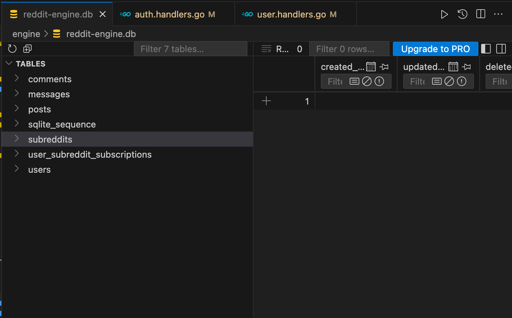

# **Project Report: Part II**

COP5615: Distributed Operating Systems Principles  
**Fall 2024**

   

**Nitin Goyal**  
Email: [nitin.goyal@ufl.edu](mailto:nitin.goyal@ufl.edu)  
Electrical and Computer Engineering  
University of Florida

 

**Nov 24, 2024**

## Overview

Part 2 of the project implements a rest interface for the reddit actor system. The actor system is deployed on port 8080 and the rest interface is deployed on port 5678. Protocol buffers are used to do the communication with the reddit actor system.

## Usage

### Running the engine

- checkout to `./engine` directory
- Run `go mod tidy` to install dependencies
- Run `go build .` to build the project
- Run `./reddit-clone` to start the engine

This will spin up an HTTP server on port 5678. The server will be ready to accept requests from the client.

### Running the client

Client is any program that could send a REST request to the server. I have used Postman as the client interface and to perform operations. But this could be integrated with any number of applications - web or mobile.

Here is the link to the postman collection that could be used to test the HTTP server - 

`https://app.getpostman.com/join-team?invite_code=b6a8e7bba6908d5aeea6b5c5cf25a0af&target_code=20d964e315481a33e923775920c5a50c`

The engine uses JWT tokens for authentication. The client should first register a user and then login to get the token.

I haven't used any authorization header, the token is sent with the request payload (body), you can follow the postman collection or the protocol buffer definitions to determine the appropriate payload for each request.

Since the data is persisted in a SQLite database, multiple clients can be spawned to test the system. The system is designed to be stateless, so the clients can be run in parallel.

If the SQLite file is not already present the engine will initialize it first. Here is the view of the database -

## Demo Video

I implemented and tested the following functions of the reddit -

1. User Registration, Authentication and Authorization
2. Subreddit Creation and Subscribe, Unsubscribe
3. Post Creation, Fetch Posts by Subreddit, by User (feed ordered by creation time), Upvote a post and changes the author karma
4. Comment Creation

Here is the link to the video of me running the server and client to demonstrate the functionality of the system -

[Demo Video](https://www.loom.com/share/c1569cf0f72f4b4f8f6b0ab7dc0fc354?sid=b1c01f79-a547-4fca-8c6e-0745c54a6d5e)

The video is also available as .mp4 file with the submission.
