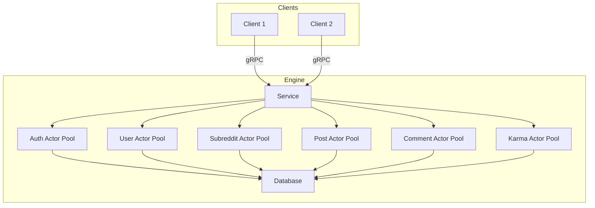

# Reddit Engine

## Project Overview

**Rabbit Engine** is an academic project developed as part of the COP5615: Distributed Operating Systems Principles course at the University of Florida (Fall 2024). The objective was to design and implement a highly concurrent backend system, inspired by Reddit, using the actor model architecture with `Proto.actor` in `Go`. The project features both HTTP and gRPC support for flexible multi-client and service connectivity.

**What I Did:**
- Designed and implemented a multi-layered backend architecture using Go and Proto.actor.
- Developed actors to encapsulate all core entities and actions (users, subreddits, posts, comments, authentication, and karma).
- Built a RESTful HTTP API and gRPC endpoints for communication between engine and clients.
- Leveraged SQL (SQLite) as a backend datastore and implemented a repository pattern for data abstraction.
- Created a client simulator to stress-test the system under various user and subreddit scenarios.
- Conducted extensive simulations to test scalability, concurrency, and fault tolerance.

**What I Learned:**
- Deepened understanding of the distributed actor model and its application in real-world concurrency problems.
- Gained practical experience with Proto.actor and Go’s concurrency primitives.
- Explored inter-process communication using protocol buffers (protobuf) and gRPC.
- Learned to design for scalability and reliability, including supervision trees and actor lifecycle management.
- Understood challenges in distributed state, coordination, and fault recovery.

---

## High-Level Architecture



## Setup and Running Instructions

### Prerequisites

- Go 1.20+ installed
- (Optional) SQLite3 CLI for inspecting the database

### Engine Setup

1. Clone the repository and navigate to the `engine` directory:
    ```bash
    git clone https://github.com/nitingoyal0996/reddit-engine.git
    cd reddit-engine/engine
    ```
2. Install dependencies:
    ```bash
    go mod tidy
    ```
3. Build the engine:
    ```bash
    go build -o reddit-engine
    ```
4. Run the engine:
    ```bash
    ./reddit-engine
    ```

### Client Setup

1. Navigate to the `client` directory:
    ```bash
    cd ../client
    ```
2. Install dependencies:
    ```bash
    go mod tidy
    ```
3. Build the client:
    ```bash
    go build -o reddit-client
    ```
4. Run simulations (examples):
    ```bash
    ./reddit-client 1 1000         # Simulate 1000 user registrations/logins
    ./reddit-client 2 500 10       # Simulate Zipf subreddit distribution
    ./reddit-client 3 1000         # Simulate user connect/disconnect
    ```
    **Note:** Reset the database before each run to avoid test data conflicts.
