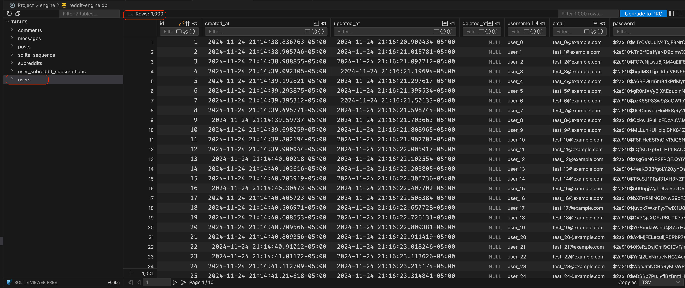
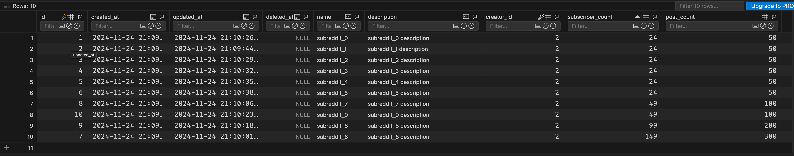
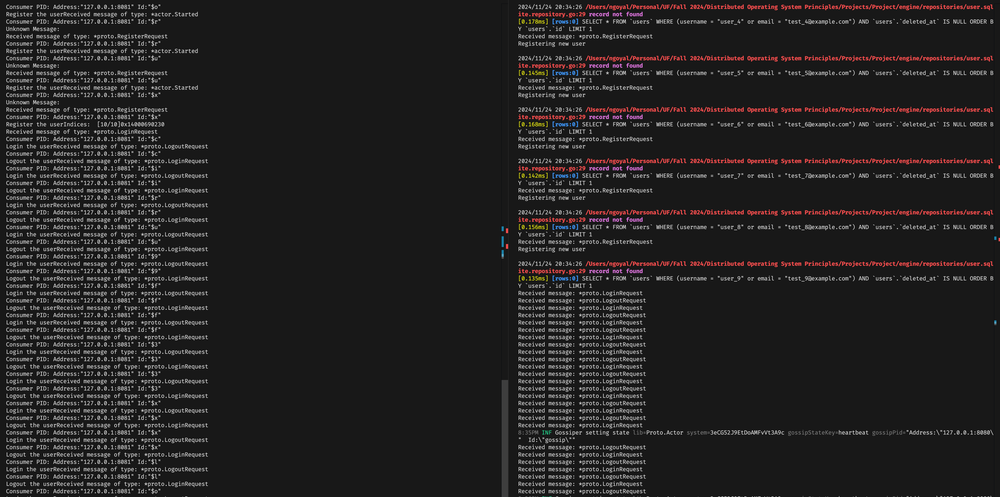

<div align="center">

# **Project Report: Nakali Reddit**

COP5615: Distributed Operating Systems Principles  
**Fall 2024**

<br><br><br>

**Nitin Goyal**  
Email: [nitin.goyal@ufl.edu](mailto:nitin.goyal@ufl.edu)  
Electrical and Computer Engineering  
University of Florida

<br>

**Nov 24, 2024**

</div>

## Overview


## Usage

### Running the engine

- checkout to `./engine` directory
- Run `go mod tidy` to install dependencies
- Run `go build .` to build the project
- Run `./reddit-clone` to start the engine

### Running the client

Now, check out to the `./client` directory
- Run `go mod tidy` to install dependencies
- Run `go build .` to build the project

Since client simulates specific scenarios, you can run the client with the following command:

```bash
./client <simulation_number> <number_of_users> <number_of_subreddits>
```

Each client run expects empty database because the test data is being generated based on count. If not done, the system will throw errors and the simulation may run.

*The three scenarios are* -

**Simulation 1: Many Users - Registration and login**:

- This simulation will create a large number of users and test the registration and login functionality of the system.

**Simulation 2: Many Subreddits - Zipf Member Subscription**:

- This simulation will generate a zipf distributed based on the input number of users and number of subreddits. Each member subscribed to the subreddit will generate two posts in it.

**Simulation 3: User Connection and Disconnection**:

- This simulation will periodically select a random user from the consumer pool and login. It will wait for the specified amount of time and then log out.
- Since the project uses JWT tokens for authentication, there is no state on the engine. The client will generate a new token for each login request.

## Simulation Results

### Scenario 1:

Largest number of users tests - 1000 - registration and login

```bash
./client 1 1000
```


### Scenario 2:


```bash
./client 2 500 10
```
The subscriber count of the reddit here is in Zipf distribution. The number of posts in each subreddit is double the subscriber count.

### Scenario 3:
the default connection duration is set to 5 seconds, it could be changed and increased in the main.go file of client module.

```bash
./client 3 1000
```

